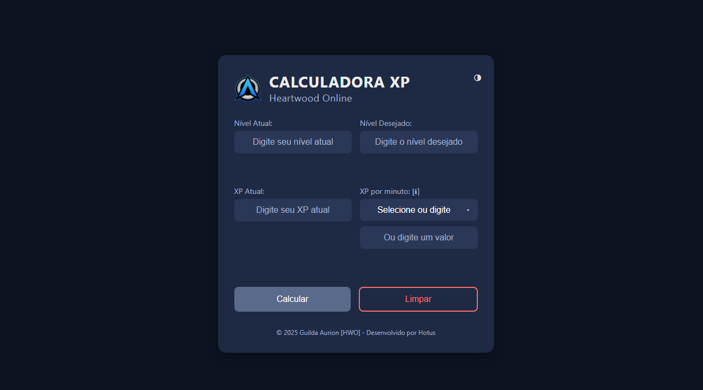

# Calculadora de XP - Heartwood Online

Bem-vindo à **Calculadora de XP** para o jogo *Heartwood Online*! Esta é uma ferramenta simples e prática para calcular o XP necessário e o tempo estimado para subir de nível no jogo. Desenvolvida pela Guilda Aurion [HWO], ela é ideal para jogadores que querem planejar sua progressão.




## Como Usar

1. Acesse o site em: [https://hotusbr.github.io/CalculadoraXP/](https://hotusbr.github.io/CalculadoraXP/)

2. Insira os seguintes dados:
   - **Nível Atual**: Seu nível atual no jogo.
   - **Nível Desejado**: O nível que você quer alcançar.
   - **XP Atual**: A quantidade de XP que você já tem.
   - **XP por Minuto**: Quanto XP você ganha por minuto (selecione uma opção ou digite um valor personalizado).

3. Clique em **Calcular** para ver:
   - O XP total necessário para atingir o nível desejado.
   - O tempo estimado com base no seu XP por minuto.

4. Use o botão **Limpar** para recomeçar.

**Dica**: Passe o mouse sobre "XP por minuto" para ver como calcular seu XP/min!


## Funcionalidades
- Interface responsiva (funciona em desktop e mobile).
- Modo claro e escuro (alterne com o botão no canto superior direito).
- Validação de entrada para evitar erros.
- Cálculo automático de XP e tempo estimado.


## Tecnologias
- **HTML**: Estrutura da página.
- **CSS**: Estilização e temas (claro/escuro).
- **JavaScript**: Lógica de cálculo e interatividade.
- Hospedado no **GitHub Pages**.


## Instalação Local (Opcional)
Se quiser rodar localmente:
1. Clone este repositório:
   ```bash
   git clone https://github.com/hotusbr/CalculadoraXP.git

2. Abra o arquivo index.html em um navegador.
   

## Releases
   - **v1.0.0**: [2025.02.28-1] Versão Inicial - Calculadora de XP (atual).


## Contribuição
Quer sugerir melhorias? Abra uma **issue** ou envie um **pull request**! Todas as ideias são bem-vindas.


## Créditos
- Desenvolvido por **Hotus** para a **Guilda Aurion [HWO]**.
- © 2025 Guilda Aurion [HWO].
